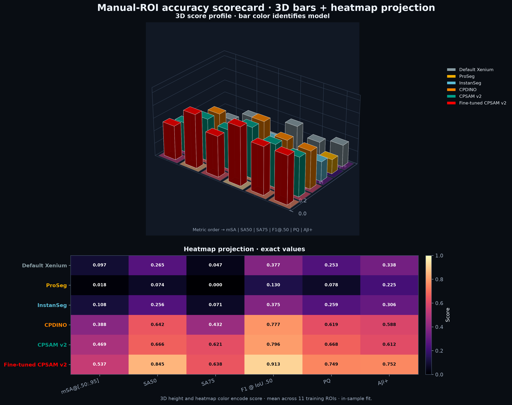
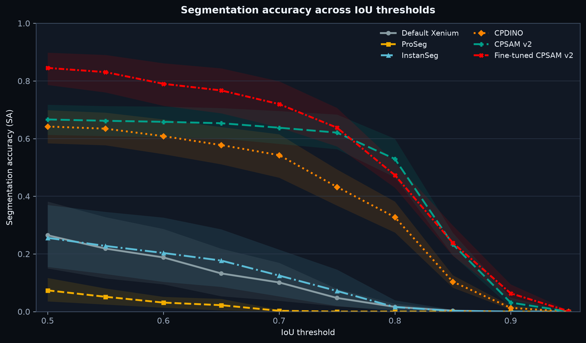
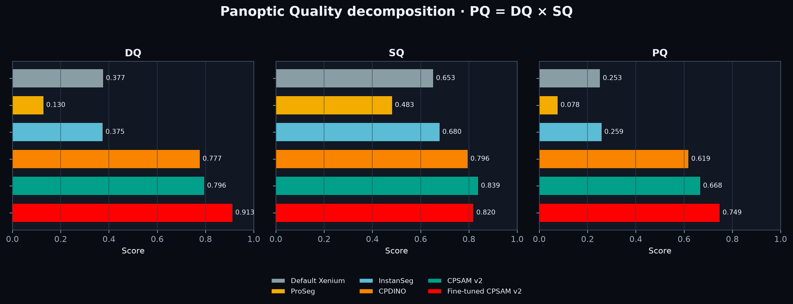
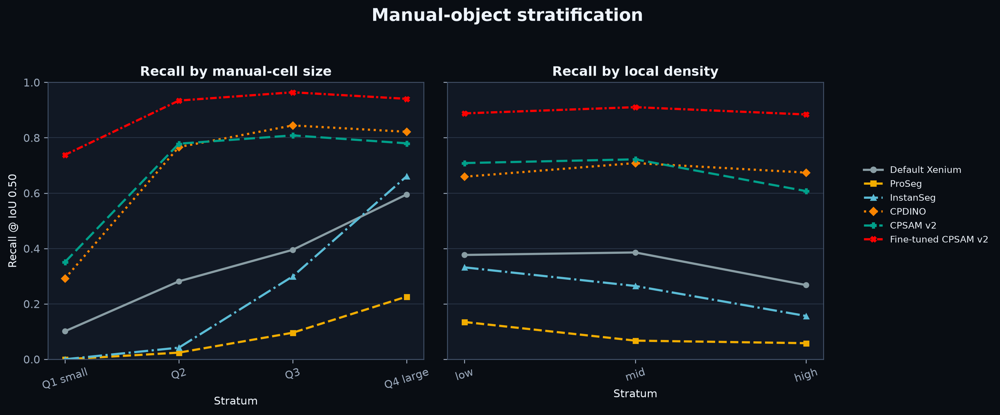

# Spatial Segmentation Benchmark

Reproducible workflows for fine-tuning CPSAM v2 and comparing
instance-segmentation outputs in spatial transcriptomics. The repository
provides model training, mask evaluation, error analysis, stratified summaries,
figures, and benchmark report generation.

## Scope

Included:

- one-reference/one-prediction instance-mask evaluation CLI;
- configurable CPSAM v2 fine-tuning with optional held-out validation data;
- training preflight, provenance, model smoke test, and loss-history figure;
- multi-model, multi-region benchmark pipeline;
- IoU-threshold curves and detection metrics;
- matched overlap and boundary metrics in physical units;
- PQ/DQ/SQ and AJI+;
- miss, spurious, split, merge, poor-overlap, and complex errors;
- size, density, tissue, and robust-SNR stratification;
- global/medullary Xenium utility summaries;
- bootstrap confidence intervals, figures, report generation, and validation;
- synthetic regression tests.

Not included: private study data or annotation files.

## Example outputs

The committed figures are aggregate, presentation-oriented examples. They do
not contain manual masks or source images.









## Repository layout

```text
src/segbench/
  metrics.py                  core matching and metrics
  stratify.py                 SNR, density, quantiles, bootstrap
  io.py                       raster/vector ROI readers
  cli.py                      single-pair command-line interface
scripts/
  00_preflight_inventory.py
  01_prepare_common_rois.py
  02_calibrate_boundary_tolerance.py
  03_compute_manual_reference_metrics.py
  04_compute_global_medullary_metrics.py
  05_compute_stratified_metrics.py
  06_classify_error_cases.py
  07_render_benchmark_figures.py
  08_build_benchmark_report.py
  09_validate_benchmark.py
training/
  prepare_training_data.py
  preflight_training.py
  train_cpsam_v2.py
  validate_trained_model.py
  plot_training_history.py
  run_training_pipeline.sh
config/                       placeholder configurations only
tests/                        synthetic-mask regression tests
docs/DATA_CONTRACT.md         required input formats
run_evaluation_pipeline.sh    full benchmark entry point
```

## CPSAM v2 fine-tuning

The fine-tuning workflow is manifest-driven and supports configurable channel
axis, training parameters, compute device, and an optional held-out validation
split.

Create a manifest from the provided example:

```bash
cp config/training_manifest.example.csv /path/to/training_manifest.csv
```

Each manifest row defines an image/instance-mask pair and its split:

```text
region,split,image_path,label_path
region_001,train,/path/to/image_001.tif,/path/to/mask_001.tif
region_002,validation,/path/to/image_002.tif,/path/to/mask_002.tif
```

The `split` column is optional; rows default to `train` when it is absent. Images
must be 3D TIFF arrays with one channel axis and two spatial axes. Labels must be
registered 2D integer instance masks with `0` as background.

Run the complete fine-tuning workflow with a Cellpose-compatible Python
environment:

```bash
export PYTHON_BIN=/path/to/cellpose/bin/python

N_EPOCHS=<selected_epoch_count> \
LEARNING_RATE=<selected_learning_rate> \
WEIGHT_DECAY=<selected_weight_decay> \
bash training/run_training_pipeline.sh \
  /path/to/training_project \
  /path/to/training_manifest.csv
```

The pipeline performs:

1. input validation, label reindexing, and provenance capture;
2. Cellpose/model/device preflight checks;
3. CPSAM v2 fine-tuning with optional validation data;
4. trained-model reload and smoke testing;
5. training/validation loss-history visualization.

Important outputs include the trained model, `losses.csv`,
`training_metadata.json`, `final_model_smoke_test.json`, and
`training_history_dark.png`. See [training/README.md](training/README.md) for all
configuration variables and output paths.

## Installation

With `conda`:

```bash
conda env create -f environment.yml
conda activate spatial-segmentation-benchmark
```

Or with `venv`:

```bash
python -m venv .venv
source .venv/bin/activate
python -m pip install --upgrade pip
python -m pip install -e .
```

Run the tests:

```bash
python -m unittest discover -s tests -v
```

## Quick start: evaluate two instance masks

Both TIFFs must be registered 2D integer label images with `0` as background
and a unique positive integer for each cell.

```bash
segbench-evaluate \
  --reference /private/path/manual_mask.tif \
  --prediction /private/path/model_mask.tif \
  --pixel-size-um 0.2125 \
  --output-dir /private/path/evaluation_output
```

Equivalent script entry point:

```bash
python scripts/evaluate_instance_masks.py \
  --reference /private/path/manual_mask.tif \
  --prediction /private/path/model_mask.tif \
  --pixel-size-um 0.2125 \
  --output-dir /private/path/evaluation_output
```

Single-pair outputs:

```text
summary.json
threshold_metrics.csv
object_metrics.csv
boundary_metrics.csv
error_events.csv
```

By default, instances touching the crop boundary are excluded because their
true extent is unknown. Use `--keep-border-objects` only when the crop contains
complete objects or the study explicitly requires a different convention.

## Full multi-model benchmark

Copy the example YAML files to a private location, replace every placeholder,
and never commit the populated copies.

```bash
cp config/benchmark_config.example.yaml /private/path/benchmark_config.yaml
cp config/model_registry.example.yaml /private/path/model_registry.yaml
```

Then run:

```bash
bash run_evaluation_pipeline.sh --manual-only \
  /private/path/benchmark_workspace \
  /private/path/benchmark_config.yaml \
  /private/path/model_registry.yaml
```

This mode evaluates all registered masks against the manual regions, computes
strata and error classes, renders figures, builds the HTML report, and runs
validation. It does not read Xenium reimport outputs.

To add global/medullary utility analysis, run without `--manual-only`:

```bash
bash run_evaluation_pipeline.sh \
  /private/path/benchmark_workspace \
  /private/path/benchmark_config.yaml \
  /private/path/model_registry.yaml
```

Global/medullary utility requires Xenium reimport outputs for every model. See
[the data contract](docs/DATA_CONTRACT.md).

## Evaluation population and matching

For each manual region:

1. Confirm that reference and prediction have the same 2D shape.
2. Optionally remove every reference and predicted instance touching the ROI border.
3. Relabel remaining instances contiguously without changing their pixels.
4. Compute every pairwise intersection, IoU, and Dice value.
5. Perform one-to-one Hungarian matching.

For a threshold `t`, matching is **threshold-aware**: it first maximizes the
number of pairs with `IoU >= t`, then uses IoU to break ties. This avoids a
known failure mode in which maximizing total IoU alone can produce fewer true
positives at the requested threshold.

All counts use:

```text
TP(t) = number of one-to-one matched pairs with IoU >= t
FP(t) = number of predicted instances - TP(t)
FN(t) = number of reference instances - TP(t)
```

Unless explicitly stated otherwise, the multi-region report computes a metric
within each ROI and then reports the unweighted mean across ROIs. Thus each
manual region contributes equally rather than allowing a cell-rich region to
dominate.

## Metrics: calculation and interpretation

Let `G` be a reference instance and `P` a predicted instance.

### 1. Intersection over Union and Dice

```text
IoU(G,P)  = |G ∩ P| / |G ∪ P|
Dice(G,P) = 2|G ∩ P| / (|G| + |P|)
```

- **Matched IoU** measures area agreement among instances successfully matched
  at IoU 0.50.
- **Matched Dice** is a monotonic overlap alternative that is numerically more
  forgiving than IoU.
- Mean and median are reported over IoU-0.50 true-positive pairs only.

Interpretation: high matched IoU/Dice with low recall means that detected cells
look good but many reference cells are still missed. These metrics must not be
reported alone.

### 2. Segmentation Accuracy at IoU threshold `t`

```text
SA(t) = TP(t) / [TP(t) + FP(t) + FN(t)]
```

Reported values:

- **SA50**: `SA(0.50)`;
- **SA75**: `SA(0.75)`;
- **mSA@[0.50:0.95]**: arithmetic mean of SA at
  `0.50, 0.55, ..., 0.95`;
- **threshold curve**: the complete SA sequence.

Interpretation: SA penalizes misses and extra cells simultaneously. SA50
reflects usable object detection plus moderate overlap; SA75 demands more
accurate shape agreement. mSA rewards performance that remains stable as the
overlap requirement becomes strict. It is not COCO mAP and should not be named
"AP".

### 3. Detection Precision, Recall, and F1 at IoU 0.50

```text
Precision = TP / (TP + FP)
Recall    = TP / (TP + FN)
F1        = 2 × Precision × Recall / (Precision + Recall)
```

- **Precision** asks: among predicted cells, how many correspond to a manual cell?
- **Recall** asks: among manual cells, how many were recovered?
- **F1** summarizes their balance.

Interpretation: low precision suggests over-segmentation or spurious cells; low
recall suggests missed cells or severe merges. F1 does not measure boundary
quality once a pair passes IoU 0.50.

### 4. Boundary Precision, Recall, F1, and NSD

For each IoU-0.50 matched pair, inner pixel boundaries are extracted. Pixel
distances are converted to micrometers using `pixel_size_um`. At tolerance
`tau`:

```text
Boundary precision = fraction of predicted-boundary pixels within tau of GT
Boundary recall    = fraction of GT-boundary pixels within tau of prediction
Boundary F1        = harmonic mean of boundary precision and recall
NSD                = boundary pixels within tau in both directions
                     / total boundary pixels in both directions
```

The default sensitivity grid is `0.5, 1.0, 1.5, 2.0 µm`.

Interpretation: these metrics distinguish a plausible contour from a mask that
only has acceptable area overlap. They are conditional on IoU-0.50 matched
instances, so they describe boundary quality among detected cells, not
whole-dataset detection performance.

If independent repeat annotations are unavailable, no single tolerance is
declared primary. The report must present a tolerance-sensitivity curve. A
future primary tolerance should be derived from repeat-annotation disagreement,
not chosen to favor one model.

### 5. Panoptic Quality, Detection Quality, and Segmentation Quality

Using IoU-0.50 one-to-one matches:

```text
DQ = TP / [TP + 0.5 FP + 0.5 FN]
SQ = mean IoU of true-positive pairs
PQ = DQ × SQ
```

- **DQ** measures whether the correct instances were found.
- **SQ** measures overlap quality among found instances.
- **PQ** combines both.

Interpretation: always show DQ and SQ with PQ. Two models can have the same PQ
for different reasons: one may detect more cells with rough boundaries, while
another detects fewer cells but segments them accurately.

### 6. AJI+

AJI+ uses a one-to-one IoU-maximizing assignment. Its numerator is the sum of
matched intersections. Its denominator is the sum of matched unions plus the
areas of all unmatched reference and predicted instances:

```text
AJI+ = sum(matched intersections)
       / [sum(matched unions) + sum(unmatched GT areas)
          + sum(unmatched prediction areas)]
```

Interpretation: AJI+ combines foreground coverage and instance correspondence
and connects with pathology segmentation literature. It is sensitive to large
objects and is therefore a supplement, not the sole conclusion.

### 7. Error classes

A bipartite graph connects a reference and predicted instance when their
intersection covers at least `error_overlap_fraction` of either object. The
default is 0.25, with 0.10 reported as a sensitivity analysis.

| Error | Graph pattern | Meaning |
|---|---|---|
| miss | one reference, no prediction | reference cell not recovered |
| spurious | no reference, one prediction | extra predicted cell |
| split | one reference, multiple predictions | one cell divided into pieces |
| merge | multiple references, one prediction | adjacent cells fused |
| poor_overlap | one-to-one component, IoU < 0.50 | correspondence exists but shape/location is inadequate |
| complex | multiple references and predictions | mixed split/merge topology |

Event counts are normalized per 100 retained reference instances for model
comparison. Because graph topology depends on the overlap-fraction rule, the
threshold and sensitivity result must accompany the plot.

### 8. Size, density, tissue, and SNR strata

- **Size**: reference-cell area in `µm²`, divided into within-dataset quartiles.
- **Density**: number of other reference centroids within the configured radius
  (20 µm by default), divided into low/mid/high quantiles.
- **Tissue**: ROI classification from overlap with the supplied tissue-region
  GeoJSON; default labels are `medullary` (>=80%), `mixed` (20–80%), and
  `outside` (<20%).
- **Robust SNR** for each channel:

```text
SNR = [median(foreground) - median(background)]
      / [1.4826 × MAD(background)]
```

Foreground is the union of retained manual cells. SNR strata are ROI-level
low/mid/high quantiles.

Interpretation: stratification identifies where a model fails. Quantile labels
are relative to the evaluated dataset and are not universal biological cutoffs.

### 9. Global and medullary utility metrics

These metrics are calculated from each model's Xenium reimport output:

- segmented cell count;
- cells per mm² using the supplied scope area;
- median and mean transcripts per cell;
- median detected genes per cell, defined as nonzero matrix features;
- empty-cell fraction;
- cell-area quartiles;
- fraction of QV>=20 transcripts assigned to a non-`UNASSIGNED` cell.

Interpretation: these describe segmentation yield and transcript partitioning.
They are **not accuracy metrics** because no manual ground truth is used at the
global or medullary scale. Higher cell count or transcript assignment is not
automatically better; over-segmentation and implausible cell expansion can both
increase utility-looking values.

## Confidence intervals

The default report uses 2,000 percentile bootstrap iterations at the manual-ROI
level. Regions, not individual cells, are resampled with replacement. The point
estimate is the unweighted mean of region-level values and the interval is the
2.5th–97.5th percentile of bootstrap means.

Interpretation: this interval quantifies variability across the supplied ROIs.
It does not correct for non-representative ROI selection and does not establish
generalization to another specimen.

## Full-pipeline outputs

Important tables:

```text
metrics/manual_roi_metrics.csv
metrics/manual_macro_summary.csv
metrics/sa_threshold_curve_by_roi.csv
metrics/sa_threshold_curve_macro.csv
metrics/matched_boundary_metrics.parquet
metrics/boundary_sensitivity_macro.csv
metrics/object_outcomes.parquet
metrics/object_stratified_metrics.csv
metrics/roi_stratified_metrics.csv
metrics/error_events.parquet
metrics/error_summary_by_roi.csv
metrics/global_medullary_utility.csv
```

Important figures:

```text
01_manual_accuracy_scorecard.png
02_sa_threshold_curve.png
03_detection_iou50.png
04_boundary_tolerance_sensitivity.png
05_pq_decomposition.png
06_error_spectrum.png
07_size_density_strata.png
08a_global_utility.png
08b_medullary_utility.png
08c_scope_utility_contrast.png
09_representative_failures.png
```

## Interpretation checklist

Before sharing a result, confirm that:

1. masks are registered, integer-valued filled instances;
2. pixel size and ROI coordinates use the correct units;
3. border exclusions and retained instance counts are reported;
4. mSA is accompanied by SA50, SA75, and the threshold curve;
5. precision, recall, and F1 are shown together;
6. boundary tolerance is stated in micrometers;
7. boundary metrics are labeled conditional on IoU-0.50 matches;
8. PQ is accompanied by DQ and SQ;
9. error thresholds and sensitivity analyses are disclosed;
10. global/medullary utility is not described as ground-truth accuracy;
11. ROI-level bootstrap and macro averaging are stated;
12. in-sample results are not presented as validation or generalization.

## Study-specific caveat

When a model is fine-tuned using the same manual regions used for evaluation,
the resulting metrics are **in-sample fit diagnostics**. They can demonstrate
that the model learned the target annotations, but cannot estimate performance
on unseen specimens. A generalization claim requires a genuinely independent
sample or pre-specified held-out regions.

## Clone the repository

Clone with SSH:

```bash
git clone git@github.com:YepBLab/spatial-segmentation-benchmark.git
```

Or clone with HTTPS:

```bash
git clone https://github.com/YepBLab/spatial-segmentation-benchmark.git
```

## Pre-push private-data audit

Run from the repository root:

```bash
git status --short
git ls-files
rg -n '/n/groups|/Users/|manual_label|\.h5ad|\.zarr|\.tif|\.parquet' \
  --glob '!README.md' --glob '!docs/**' --glob '!config/*.example.yaml'
```

Review every match before pushing. Placeholder paths in example configuration
and format names in documentation are expected; real paths are not.

## License

Released under the [MIT License](LICENSE).
